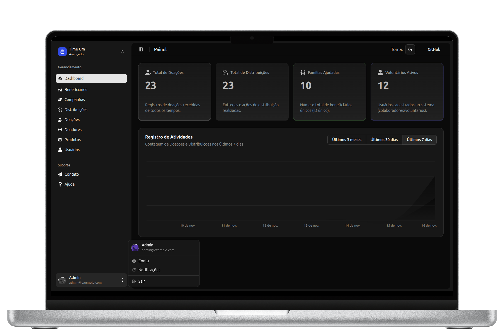
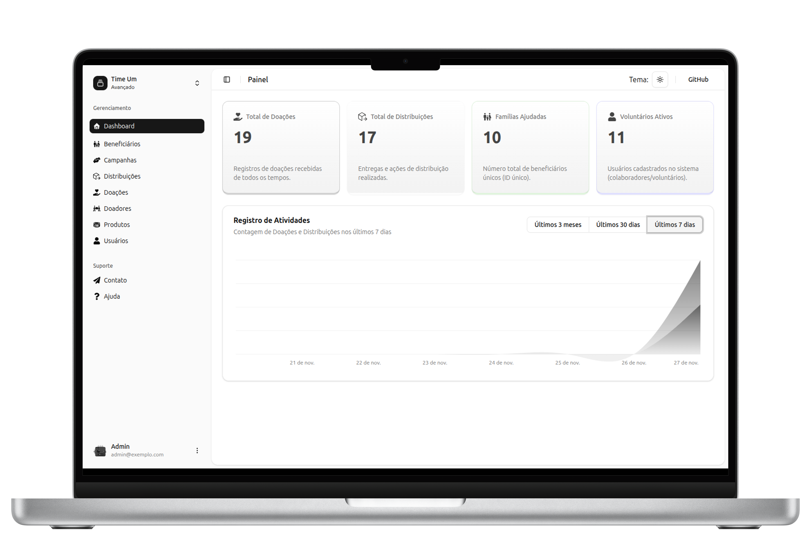

# SFSys

O SFSys (Sistema ONG Sem Fome) é uma aplicação completa e robusta projetada para otimizar e centralizar a gestão de ponta a ponta da ONG Sem Fome, com foco em causas sociais, como a distribuição de alimentos e recursos.

O principal objetivo é fornecer uma plataforma intuitiva e segura para gerenciar todas as operações-chave, desde o cadastro de doadores e o acompanhamento de campanhas até a distribuição final dos produtos aos beneficiários.


## Funcionalidades

O sistema oferece um conjunto abrangente de módulos de gestão, todos implementados com a mesma estrutura base de CRUD (Create, Read, Update, Delete) em interfaces dinâmicas (tabelas com filtros e paginação).

### Módulos de Gestão (CRUD)

O SFSys gerencia as seguintes entidades principais:

- **Beneficiários**: Cadastro e acompanhamento das pessoas ou famílias assistidas pela ONG.
- **Campanhas**: Planejamento, lançamento e acompanhamento de campanhas de arrecadação.
- **Doadores**: Registro e histórico de pessoas e empresas que contribuem com doações.
- **Doações**: Rastreamento detalhado das doações recebidas (valor, produto, data, origem).
- **Distribuições**: Controle logístico dos produtos distribuídos e registro de entrega aos beneficiários.
- **Produtos**: Gerenciamento do estoque de itens e recursos disponíveis para distribuição.
- **Usuários**: Controle de acesso e permissões dos membros da equipe da ONG.

### Recursos da Aplicação

**Autenticação Segura**: Sistema de autenticação robusto baseado em contas e tokens JWT (JSON Web Tokens), com hash de senha via Argon2.

**Interface Dinâmica**: Todas as tabelas de gestão possuem recursos de:

Filtros de Pesquisa Avançados;

Paginação Eficiente;

Ordenação e Organização de Colunas.

**Customização Visual**: Suporte a Tema Escuro/Claro/Sistema (Dark/Light Mode/System).

**Relatórios**: Funcionalidades de exportação de dados (exports) das tabelas para geração de relatórios. Suporta **CSV, Excel, PDF e JSON**.

**Gerenciamento de Perfil**: Página dedicada para edição e controle do perfil do usuário.

**Central de Notificações**: Sistema de notificações para alertas e atualizações importantes.

**Páginas de Suporte**: Inclui páginas de Contato e Ajuda.

**Regras de Negócio e Validações**: Implementação rigorosa de validações e regras de negócio para garantir a integridade dos dados.
## Stack utilizada

**Back-end:** Node, Express, Sequelize ORM, MySQL

**Front-end:** React, TailwindCSS, ShadcnUI, React Query


## Documentação da API

A documentação interativa da API RESTful, gerada com Swagger, está acessível no endpoint abaixo, após a inicialização do backend:

**Endpoint da Documentação**: http://localhost:3000/api-docs


## Variáveis de Ambiente

Para rodar esse projeto, você vai precisar adicionar as seguintes variáveis de ambiente no seu .env.development.local

### Geral
`NODE_ENV`

`PORT`

`JWT_SECRET`

`JWT_EXPIRATION`

`REFRESH_TOKEN_SECRET`

`REFRESH_TOKEN_EXPIRATION`

`ADMIN_INITIAL_EMAIL`

`ADMIN_INITIAL_PASSWORD`

### Configuração do MySQL Local
`DB_DIALECT`

`DB_HOST`

`DB_USER`

`DB_PASS`

`DB_NAME`
## Rodando localmente

Siga os passos abaixo para configurar e rodar o SFSys em seu ambiente local.

Pré-requisitos

Certifique-se de ter o seguinte instalado em sua máquina:

- **Node.js** (LTS recomendado)

- **MySQL**

### 1. Configuração do Banco de Dados

É necessário criar um banco de dados MySQL e configurar as credenciais de conexão no backend (consulte o tutorial específico na pasta /backend para detalhes sobre as variáveis de ambiente).

### 2. Instalação e Configuração

Navegue até os diretórios do backend e frontend separadamente para instalar as dependências.

Clone o repositório

git clone https://github.com/feelipechs/SFSys.git

Navegue para o diretório do Backend
```bash
cd backend
```
```bash
npm install
```
Navegue para o diretório do Frontend
```bash
cd frontend
```
```bash
npm install
```

### 3. Migrações e Seeds

Após a instalação, execute as migrações para criar as tabelas no seu banco de dados e, em seguida, execute as seeds para popular o banco com dados iniciais (incluindo uma conta de usuário "admin" para login).

No diretório principal **/backend**
```bash
npm run db:migrate
```
```bash
npm run seed
```

### 4. Inicialização das Aplicações

Execute os comandos de inicialização para o servidor backend e o aplicativo frontend.

#### Iniciar o Servidor Backend (API)
```bash
cd backend
```
```bash
npm run dev
```

A API estará acessível em http://localhost:3000 (ou porta definida no .env). O ambiente development roda com nodemon.

#### Iniciar o Aplicativo Frontend (Interface)
```bash
cd frontend
```
```bash
npm run dev
```

O aplicativo frontend estará acessível em http://localhost:5173

## Screenshots





